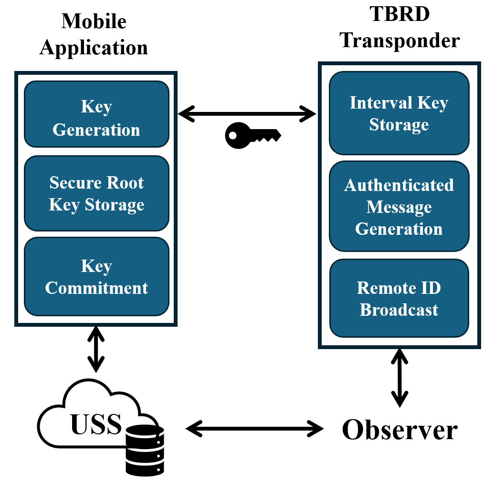
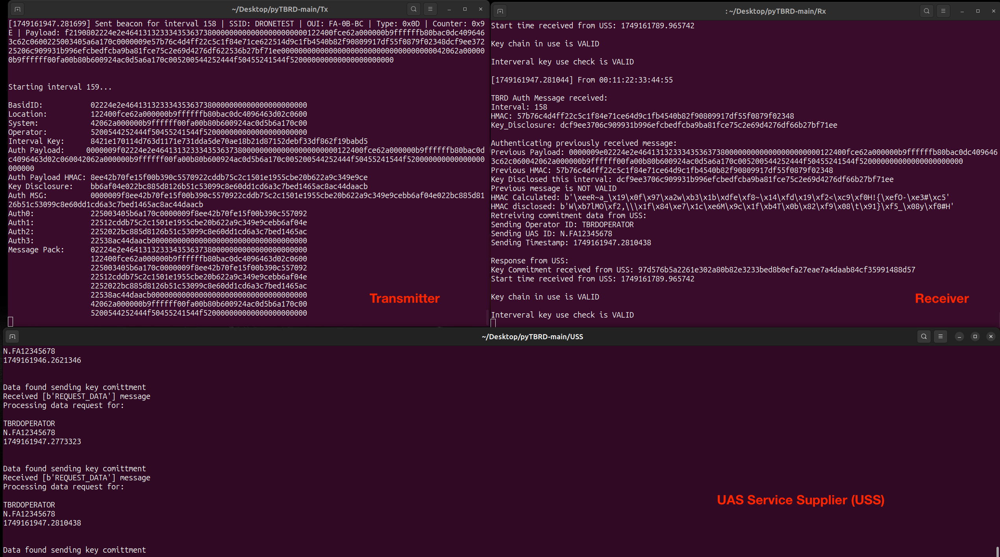

# TESLA Authenticated Broadcast Remote ID
This repository is a proof of concept implementation of TESLA Authenticated Broadcast Remote ID (TBRD). TBRD utilizes a mobile device's dedicated security processor, the Timed-Efficient Stream Loss-tolerant Authentication (TESLA) protocol, and a trusted UAS service supplier (USS) to generate/transmit/receive authenticated RemoteID broadcast messages.  This system is meant to comply with the ASTM F3411-22 standard and builds upon the existing implementation from [OpenDroneID](https://github.com/opendroneid).

<div align="center">
  
</div>

Using the [TESLA](https://people.eecs.berkeley.edu/~tygar/papers/TESLA_broadcast_authentication_protocol.pdf) algorithm to provide broadcast authentication allows us to take advantage of the intrinsic low computational overhead, robustness to packet loss, and scalability. The purpose of the mobile device security processor is to manage key generation and secure storage of seed material. Additionally, the mobile device acts as a physical token that enables the drone operator to prove their identity and securely transmit key commitment information to the third party USS verification server. With these combined components, the system is robust in detection malicious activity such as faking an operator identity, record/reply, and packet manipulation.

## System Requirements
- TBRD Mobile App: Android device with Android 13.0 (API level 33) or higher
- Operating System: Linux (Ubuntu 20.04+ recommended)
- Wireless network interface capable of monitor mode
- Python: Version 3.8 or higher

| Package     | Version  |
|-------------|-----------|
| numpy       | 2.2.6    |
| protobuf    | 3.12.4   |
| pymavlink   | 2.4.47   |
| pyzmq       | 26.4.0   |
| scapy       | 2.6.1    |


### Install Dependencies

Use the provided `requirements.txt` file:

```bash
pip install -r requirements.txt
```

## Usage 
There are 4 main components to the TBRD proof of concept implementation.

1. TBRD Mobile Application
2. USS Server
3. TBRD Transmitter
4. TBRD Receiver

### TBRD Mobile Application
The mobile is an Andriod app that uses [Android Keystore system](https://developer.android.com/privacy-and-security/keystore) which leverages the Trusted Execution Environment (TEE) of the mobile device to generate the TBRD authentication keys.

Before flying the UAS, the pilot will use the mobile app to enter the mission information that is used to generate the TBRD keys. The pilot will enter the mission start time, mission end time, UAS ID, and Operator ID and click on the 'Generate Keys' button. The app creates a random 32-bytes long seed key in the TEE of the mobile device. This seed key is hashed using SHA-256 to generate a new 32-bytes long key for the keychain. This process of hashing the previous key to get the new key is done for the total duration of the flight + 1 times. The initial seed key never leaves the TEE. The last key in the keychain becomes the root key which is saved to a txt file and is eventually uploaded to the USS Server along with the mission information. The rest of the keychain is also stored in a separate txt file which is then uploaded to the UAS for TBRD messages. In production, the root key file and mission information for the USS could be sent over Wi-Fi and the TBRD keychain file could be sent to the UAS over Wi-Fi or Bluetooth as per the [ASTM F342211-22a](https://store.astm.org/f3411-22a.html) standard. However, for testing our system we did a manual transfer of these files. 

<div align="center">
  
</div>

### USS Server
Before running the **TBRD transmitter**, you must start the **USS server**. This server accepts and processes incoming TBRD messages.

**Command-Line Options**

| Argument   | Type   | Description                         | Default    |
|------------|--------|-------------------------------------|------------|
| `--ip`     | String | IP address to bind to               | `0.0.0.0`  |
| `--port`   | Int    | Port to bind to                      | `5555`     |

**Example Usage**

Start the USS server with default settings (listening on all interfaces at port 5555):

```bash
python uss_server.py
```

### Wireless network interface configuration
Before running either the TBRD transmitter or TBRD receiver, you must first place your wireless interface in monitor mode and configure transmit/receipt for a specific wireless channel. If you are using airmon-ng an example sequence of command would be as follows:

```
sudo airmon-ng check

sudo airmon-ng check kill

sudo airmon-ng start $interface

sudo iw dev $interfacemon set channel 6

sudo ip link set $interfacemon down

sudo ip link set $interfacemon up
```

### TBRD transmiter
The TBRD transmitter application accepts several command-line arguments for configuration:

**Command-Line Options**

| Argument | Short | Type    | Description                                      | Default          |
|----------|-------|---------|--------------------------------------------------|------------------|
| `--static` | `-s`  | Flag    | Use static data instead of a MAVLink connection | *None* (disabled)|
| `--verbose`| `-v`  | Flag    | Enable verbose output for debugging             | *None* (disabled)|
| `--udp`    | `-u`  | Flag    | Broadcast TBRD over UDP                         | *None* (disabled)|
| `--config` | `-c`  | String  | Path to configuration file                      | `tx_config.ini`  |

The TBRD transmitter can broadcast a set of static data (helpful for testing/debuggin) or it can injest simulated flight data from Ardupilto leverage software in the loop (SITL) simulation.  See the [SITL Simulation Tutorial](./SITL%20Simulation%20for%20RemoteID.md) for more information on how to setup your simulation before running the TBRD transmitter.

**Example Usage**

Run the transmitter with default settings:

```bash
python pytbrd_tx.py -c tx_config.ini
```

### TBRD Receiver

The **TBRD Receiver** listens for TBRD messages over Wi-Fi or UDP, extracts the TBRD authentication payload, and verifies the authenticity of each payload.

**Command-Line Options**

| Argument    | Short | Type    | Description                                         | Default         |
|-------------|-------|---------|-----------------------------------------------------|-----------------|
| `--verbose` | `-v`  | Flag    | Enable verbose output for debugging                 | *None* (disabled)|
| `--udp`     | `-u`  | Flag    | Sniff TBRD messages over UDP instead of Wi-Fi       | *None* (disabled)|
| `--config`  | `-c`  | String  | Path to configuration file                          | `rx_config.ini` |

**Example Usage**

Sniff Wi-Fi beacons from a specific BSSID:

```bash
python pytbrd_rx.py -c rx_config.ini
```

### TBRD System in Action
<div align="center">
  
</div>


****

Portions of this software and documentation was created with assistance from AI tools. The content has been reviewed and edited by a human. For more information on the extent and nature of AI usage, please contact the author.
